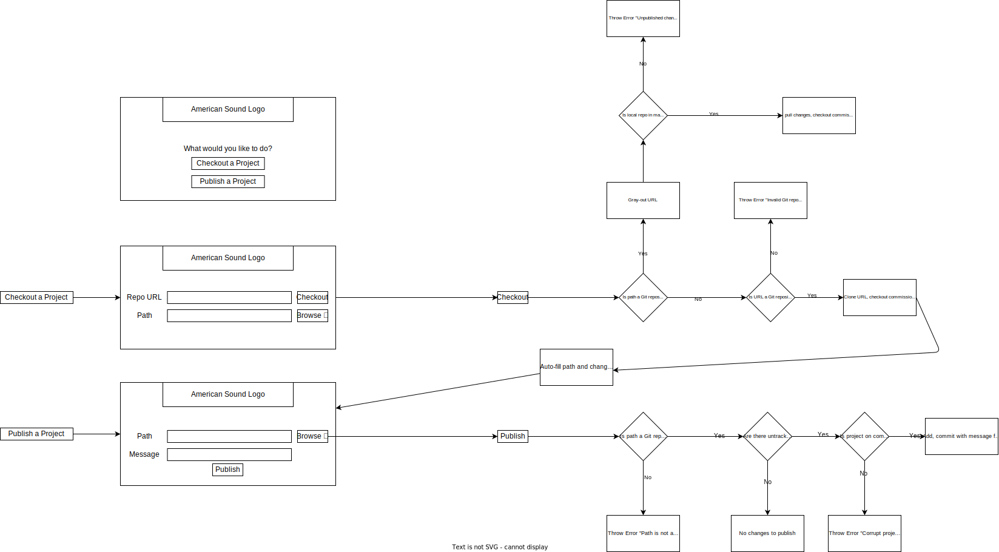

# GitBack

* [About](#about)
* [Dependencies](#dependencies)
* [Usage](#usage)
    * [Install](#install)
    * [Devs](#devs)
    * [Non-Devs](#non-devs)
    * [Usage Diagram](#usage-diagram)
* [Contributing](#contributing)
    * [Issues](#issues)
    * [Branching](#branching)
    * [Pull Requests](#pull-requests)

## About

**This repo is a work in progress but has a functioning app, installer scripts, and an automation script for ADO. Automation for other Git platforms and documentation coming soon.**

[Git](https://git-scm.com/) is a fantastic version control system for developers. However, sometimes non-developers need to work closely with developers in a way that could still make Git useful. These people should not be required to learn a tool - which can easily break if not thoroughly understood - when they only need to use an extremely small subset of its features. **GitBack** is intended to close that gap by automating a small subset of Git commands in a way that can be digestible to non-software engineers. It provides:

* The GitBack app
    * "Checkout" and "Publish" functionality that automate cloning, pulling, pushing, and branching.
    * Extensive logging of user actions, user error, and Git errors - intended to be readable to devs in case something needs fixed.
    * Links to documentation at every step in case non-devs need a streamlined refresher on how the app works.
* Automation scripts for popular Git hosting platforms
    * Scripts for automatically opening PRs for work published from the GitBack app. Your devs know Git and own the repos, they make sure everything comes together cleanly and save your non-devs time and energy.
    * Implemented for Azure DevOps. Planned support for GitHub, GitLab, and Bitbucket.

## Dependencies

[Git](https://git-scm.com/) is obviously a dependency. If you provision GitBack, you will want to provision git as well. On Windows, you will want [git for Windows](https://gitforwindows.org/) On Linux or Mac, I pray that you know what you're doing.

**If you opt to not use the installer script:** the app is written in Python, so there are a handful of dependencies located in a `requirements.txt` for your convenience.

1. Create and activate the Python virtual environment

```sh
python -m venv .venv

# bash (usually the case for Linux or Git Bash)
source .venv/bin/activate

# Windows CMD
.venv\Scripts\activate.bat

# Powershell
.venv\Scripts\activate.ps1
```

2. Install the dependencies to the virtual environment

```sh
pip install -r requirements.txt
```

## Usage

### Install

Soon, releases will include the installer found at `install/gitback.iss`. For now, you can generate the installer with that script yourself (**not recommended unless you are provisioning**) or run the appropriate install script found in the `install/` directory. There is one for Powershell, Bash (Linux), and Git for Windows.

### Devs

1. Devs should inform their non-dev counterparts that they need to have GitBack installed on their devices. It is recommended to do so either through company-wide provisioning or directly from this repository's **releases**.

2. If automatic PRs are not setup using the automation scripts, devs should manually create PRs from any commission branches that are created by non-devs.

3. Before merging a PR, the dev should ensure that there are no breaking changes with a thorough review of all changes within the PR.

4. If a non-dev reports issues to the dev, the devs should look for **logs** on the user's machine. On **Windows**, these will be located at `C:\Users\USER\AppData\Local\GitBack\GitBack\logs\`. On **Linux**, this will be in `~/.local/share/GitBack/logs/`

### Non-Devs

1. Install and/or launch GitBack

2. **Checkout** a project. You can do this with a **URL** to a remote repository and a path to an **empty** destination directory, or **no URL** and just a path to a **local Git repository**.

3. Make your changes to the code.

4. When all changes are done, **publish** them. Go to the publish page, browse to your **local copy of the repository** as checked out before, **write a message describing what you changed**, and then **publish** your changes. <ins>**YOU MUST CHECKOUT THE PROJECT AGAIN BEFORE MAKING MORE CHANGES.**</ins>

### Usage Diagram

You can download and view `pace.svg` if you cannot zoom in through here.



## Contributing

### Issues

There should be at least one issue associated with *all* contributions of *any* kind. **Bug reports** must be given the `bug` label. **Feature requests** or **improvements** must be given the `enhancement` label. **Documentation requests** should be given the `documentation` label. **All issues must have at least one label**. If you plan to address an issue, you **should assign it to yourself**.

Use proper maintainer etiquette. Sufficient name, description, environment details, and a minimal-steps-to-reproduce whenever possible.

### Branching

The `main` branch is protected. We use [trunk-based-development](https://trunkbaseddevelopment.com/). All work must be done in ephemeral branches spawned from the `main` branch. Branches must correspond to an issue. They should be named according to the following format:

```
<prefix>/<issue micro summary>-<issue #>
```

Choose from one of the following prefixes:

- `feature/` for new features. Things with the `enhancement` tag.
- `hotfix/` for bugs, security, UI adjustments, grammar correction, etc. This does not include documentation (see `doc/`).
- `doc/` for changes/additions to documentation. These do NOT Increment version number!

### Pull Requests

Pull requests will have to be reviewed by me before they can be merged, so listen up.

1. YOUR CONTRIBUTION MUST ADDRESS AN ISSUE.
2. Test your code. I'm not debugging it for you unless you ask for help.
3. Follow the code style.
4. Squash as many commits as appropriate. If you have 4 commits trying to fix a bug, squash them.
5. Proper brief title, well-formatted description (major changes, minor changes, etc.)
6. Rebase > merge **whenever possible**.
